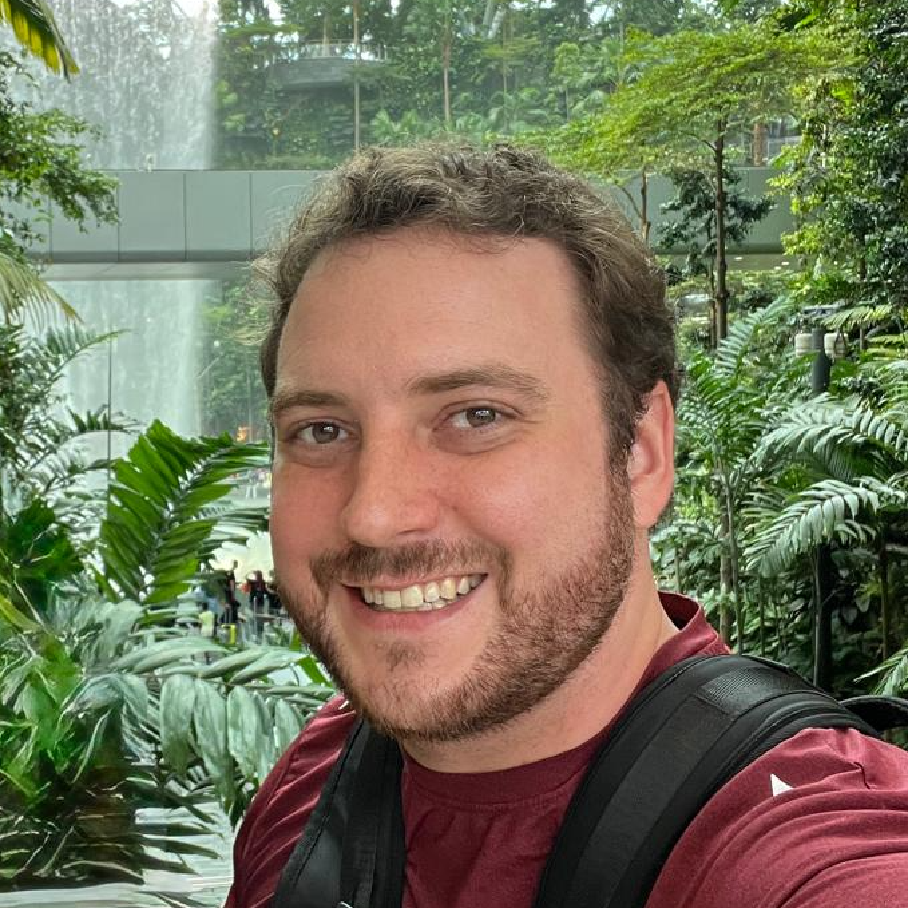

  
  
  

Hi! I'm a Computational Physicist and AI Researcher (Ph.D. Theoretical Physics, Cornell). I build accurate and efficient computational systems by combining paradigms: deterministic with stochastic, symbolic with neural, exact with approximate.

This thread runs through all my work. In quantum chemistry, I combined deterministic wavefunction selection with stochastic perturbation theory to make exact calculations tractable at scale (SHCI, 2,100+ citations). Now I apply the same thinking to AI, pairing symbolic reasoning with learned neural components so that each handles what it's best at. I've been building production AI systems since 2018 (Transformer-based semantic search, pre-BERT), deployed my algorithms on some of the largest supercomputers in the world at Lawrence Livermore National Lab, and built quantitative models for systematic trading at Citadel.

---
### Neurosymbolic AI

| Project | Description | Tech |
| :--- | :--- | :--- |
| [Geometry Theorem Prover](https://github.com/aaholmes/geoprover) | Three-tier MCTS prover: symbolic deduction (49 rules to fixed point) short-circuits the search, while a 4M-parameter transformer suggests auxiliary constructions. Solves 189/231 problems on AlphaGeometry's JGEX benchmark, including Morley's theorem and the 9-point circle. | `Rust` `PyO3` `PyTorch` |
| [Neurosymbolic Chess Engine](https://github.com/aaholmes/neurosymbolic-mcts) | Three-tier MCTS: exact mate detection and geometric pruning as terminal gates, material-aware quiescence search, and SE-ResNet neural evaluation. The symbolic tiers alone (zero-initialized NN) exceed 29 generations of pure neural self-play. 950 tests. | `Rust` `MCTS` `PyTorch` |

### Algorithms & Optimization

| Project | Description | Tech |
| :--- | :--- | :--- |
| [MMR-Elites](https://github.com/aaholmes/mmr-elites) | Quality-Diversity algorithm that reformulates archive maintenance as submodular maximization via Maximum Marginal Relevance from information retrieval. Fixed O(K) memory, O(K log K) selection, 12x better uniformity than MAP-Elites in 20-dimensional behavior spaces. | `Rust` `PyO3` `Python` |

### Quantum Chemistry

| Project | Description | Tech |
| :--- | :--- | :--- |
| [Arrow / SHCI](https://github.com/aaholmes/shci) | Reference implementation of Semistochastic Heat-Bath Configuration Interaction, the method I invented during my Ph.D. Combines deterministic selection of important wavefunction components with stochastic perturbative corrections. Hybrid MPI+OpenMP. | `C++` `MPI` `OpenMP` |
| [RISQ](https://github.com/aaholmes/risq) | Rust reimplementation of HCI and semistochastic perturbation theory. Bitstring determinant representation, Davidson eigensolver, alias sampling for O(1) stochastic draws. | `Rust` |

---
### Foundational Research

My Ph.D. research introduced Heat-Bath Configuration Interaction (HCI) ([Holmes et al., *JCTC* 2016](https://arxiv.org/pdf/1606.07453)) and Semistochastic HCI ([Sharma, Holmes et al., *JCTC* 2017](https://arxiv.org/pdf/1610.06660)), methods that replaced inefficient generate-and-test approaches with deterministic selection of the most significant wavefunction components, combined with stochastic sampling for perturbative corrections. This deterministic + stochastic combination made previously intractable calculations routine.

These methods enabled the first near-exact potential energy surfaces for fourteen electronic states of the carbon dimer ([Holmes et al., *JCP* 2017](https://pubs.aip.org/aip/jcp/article/147/16/164111/76673)) and the ground-state binding curve of the chromium dimer ([Li, Yao, Holmes et al., *Phys. Rev. Res.* 2020](https://journals.aps.org/prresearch/pdf/10.1103/PhysRevResearch.2.012015)), a grand-challenge problem that had remained outstanding for decades. SHCI is now a leading benchmark method implemented in major quantum chemistry packages.

 

---
#### Contact

I'm always happy to chat about research, projects, or opportunities. Reach me via [email](mailto:adamaholmes@gmail.com) or on [LinkedIn](https://www.linkedin.com/in/adamaholmes/).
