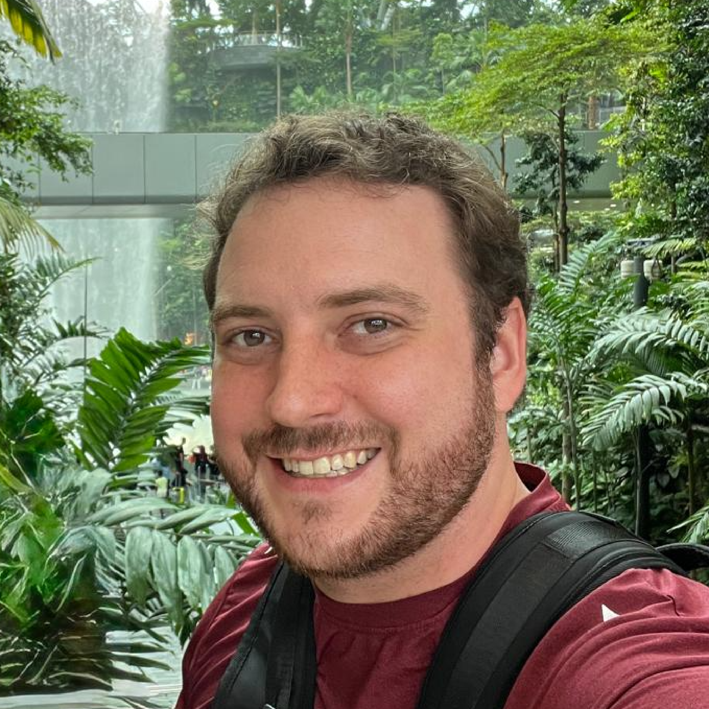
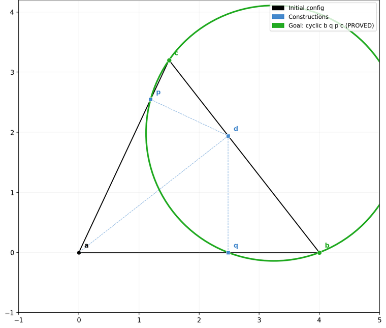
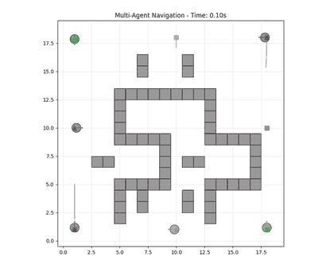
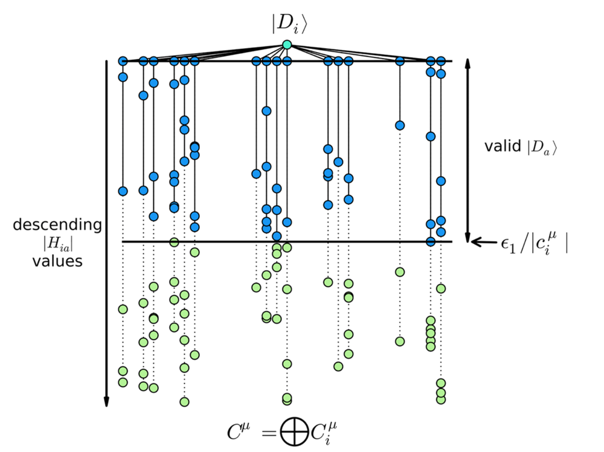

  
  
  

Hi! I'm a computational physicist and AI researcher (Ph.D. Theoretical Physics, Cornell). I work on hard search problems — where the space of possibilities is far too large to enumerate, and the whole game is deciding what to look at next.

My approach has been the same for fifteen years: **solve as much of the problem as you can with efficient exact methods, and fall back on learned or statistical ones for the remainder.** The exact layer reduces what has to be learned, and improves the training signal for what's left.

I developed this idea in quantum chemistry. A molecule's electron configurations form a graph that grows exponentially with its size, far too large to store for anything but toy problems. The method I developed during my Ph.D. (SHCI, 2,300+ citations) uses a cheap heuristic to find the small fraction of that graph that matters, searches that part exactly, and estimates the rest by sampling. It's now a standard method in the field, and the calculations I ran with it are reference benchmarks that newer neural network and quantum computing methods are compared against.

Since then I've worked on large language model efficiency, game playing, theorem proving, and chip design. Along the way I've built production AI systems since 2018 (Transformer-based semantic search, pre-BERT), run my algorithms on some of the largest supercomputers in the world at Lawrence Livermore, and built quantitative models for systematic trading at Citadel.

 

---

## Large Language Models

Inference is bottlenecked by memory movement: the model re-reads a large cache for every token it generates. Every way of shrinking that cache is lossy, so the question is how much quality you buy back.

### [Sampling-Based Attention](https://github.com/aaholmes/semistoch_attn)

Attention is a weighted average — an expectation — so it can be estimated by importance sampling instead of reading the whole cache. I implemented the unbiased estimators and measured them in a real model: systematic sampling matches full-model quality while reading **~3.5% of cached values**, and the fraction shrinks as context grows, since attention concentrates further with length.

I also tried the semistochastic version from my Ph.D. work — treat the largest weights exactly, sample the rest. It cuts variance per sample by 8–32×, and ties on bytes. Sampling with replacement already collides onto the hot tokens, and the GPU serves the repeats out of cache, so the deterministic head buys nothing you weren't getting for free.

*PyTorch · Monte Carlo · Importance Sampling*

### [Inference Engine + Post-hoc MLA](https://github.com/aaholmes/llms)

A from-scratch single-GPU inference engine for Qwen3, and a study of converting a trained model's attention to a compressed form *after* training (multi-head → multi-head latent attention). Shrinking the KV cache 1.33× costs 0.5% quality relative to a matched-budget control; **4× costs 16%**.

To claw back the loss I train a small adapter to pull the degraded model back toward the original's output distribution, targeting **total-variation distance** — the divergence that actually cashes out in sampled tokens — which beats the standard KL objective on every fidelity measure. The adapter merges into the weights, so it costs nothing at inference.

*PyTorch · Triton*

### [NanoGPT Single-GPU Harness](https://github.com/aaholmes/nanogpt-1gpu)

A single-GPU (16 GB) adaptation of the [modded-nanogpt speedrun](https://github.com/KellerJordan/modded-nanogpt) for screening architecture changes cheaply. A research **harness, not a benchmark** — the value is in the rankings, and in a methodology built not to fool itself: paired same-seed comparisons, per-variant learning-rate matching, and an assertion that every weight actually trains, all CI-enforced.

*PyTorch · Muon · NorMuon*

---

## Neurosymbolic AI

Push as much of the problem as possible onto exact computation, and learn only the residual.

### [Neurosymbolic Chess Engine](https://github.com/aaholmes/neurosymbolic-mcts)

Self-play engines like AlphaZero learn everything from scratch, including positions a classical solver settles in microseconds. This one searches classically first and treats that answer as exact, so the network only spends capacity where the classical layer can't decide.

It's really a **reward-shaping** project. Instead of rewarding only terminal positions like checkmate, it rewards any position an exact method can settle — a forced mate in N moves. The training signal gets denser, and unlike a learned reward model it cannot be gamed. The result: **~600 Elo above an identically-trained purely neural run, reached in 18 generations rather than 28.**

*Elo across self-play generations for both runs, evaluated at 800 rollouts per move.*

*Rust · MCTS · PyTorch*

### [Geometry Theorem Prover](https://github.com/aaholmes/geoprover)

The same split, applied to proofs: a deterministic engine grinds out every deduction it can reach (49 rules to fixed point), and a 4M-parameter transformer proposes the step deduction alone can't find — the auxiliary construction. Learning only the part that genuinely requires invention is what keeps the model that small.

Deduction alone solves 179 of the 231 problems in AlphaGeometry's JGEX benchmark. Adding the network's construction proposals takes it to **189/231**, and the problems it adds are the ones that need a genuine idea — Morley's theorem and the nine-point circle among them.

*A solved problem: given the black configuration, prove four points lie on a common circle. Blue dashed lines are the auxiliary constructions; green is the goal relation, proved.*

*Rust · PyO3 · PyTorch*

---

## Search & Optimization

### [GPU Macro Placement](https://github.com/aaholmes/macro-placer)

Where a chip's large memory blocks sit on the die largely sets the speed, power, and routability of everything placed after them — a step dominated by Cadence, Synopsys, and Siemens. The method combines a smooth global optimization of a differentiable proxy with simulated annealing using the full, non-differentiable loss, with a legalization step in between. Both stages run on a from-scratch reimplementation of the scorer that matches the official metric exactly and runs 50–3600× faster.

Congestion was the binding constraint, and no differentiable congestion model helped — even one correlating 0.995 with the true metric. What worked was leaving it out of the loss and aiming the *proposals* instead: nudge one block a single grid cell so an entire wire route leaves a congested line. **The heuristics only decide where to look; acceptance always uses the real score.**

In an open challenge — 17 benchmarks, one hour of compute each — it scored **34% below the reference placements**, good for at least 4th, with zero overlaps and on hardware slower than the rules allowed. Full [write-up](/projects/macro-placement/), including a paired-experiment appendix of what didn't work.

*Annealed local search using the exact objective, ibm18.*

*PyTorch · GPU · Simulated Annealing*

### [MMR-Elites](https://github.com/aaholmes/mmr-elites)

Often you don't want the single best solution but a diverse set of good ones — and selecting on quality alone gives you redundancy, because the best candidates cluster together. This reformulates keeping such a set as **submodular maximization**, borrowing Maximum Marginal Relevance from information retrieval: fixed O(K) memory, O(K log K) selection, and 12× better uniformity than MAP-Elites in 20-dimensional behavior spaces. Picking a varied, high-quality subset of LLM samples is the same problem.

*Rust · PyO3 · Python*

### [Multi-Agent Path Planning](https://github.com/aaholmes/multiagent-pathplanning)

Optimal multi-robot navigation, and the same split again: Conflict-Based Search plans globally optimal, collision-free paths up front, while Optimal Reciprocal Collision Avoidance handles what the plan can't anticipate in real time. Exact where you can be, reactive where you must be. Python bindings via PyO3; 176 tests covering the search and collision-geometry guarantees.

*Eight agents crossing a maze, each holding to its planned route while reacting locally to the others.*

*Rust · PyO3 · CBS · ORCA*

---

## Quantum Chemistry Research

My Ph.D. work introduced Heat-Bath Configuration Interaction ([Holmes et al., *JCTC* 2016](https://arxiv.org/pdf/1606.07453)) and its semistochastic extension ([Sharma, Holmes et al., *JCTC* 2017](https://arxiv.org/pdf/1610.06660)). The prior state of the art generated enormous numbers of candidate configurations and tested each one to see if it mattered. These methods use the structure of the interaction itself to jump straight to the significant ones, then recover the remainder by sampling. The selection repeats, each round expanding the space searched exactly, which made calculations that had been out of reach routine.

*Finding the important terms without generating them all. The matrix elements are computed once up front and stored in descending order of magnitude; for each candidate the algorithm walks that sorted list only until it falls below a threshold that adapts to the current coefficient, then stops. Blue gets generated, green is never touched — and the test costs constant time. Figure from [Smith, Mussard, Holmes & Sharma, *JCTC* 2017](https://doi.org/10.1021/acs.jctc.7b00900) (open access).*

The calculations that followed are the reason the method stuck. For the carbon dimer we mapped fourteen low-lying electronic states across their full range of bond lengths, in a large basis — 182 orbitals, so a space of order (182 choose 6)² ≈ **10²¹** configurations — landing within 30–50 μHa of the exact answer for that basis — 30–50× more accurate than the chemical accuracy threshold ([Holmes et al., *JCP* 2017](https://pubs.aip.org/aip/jcp/article/147/16/164111/76673)). This calculation has become a reference for modern quantum computing and neural-network based methods, because of its high accuracy across many excited states.

The chromium dimer is harder — not because it is bigger, but because an unusually large number of configurations contribute meaningfully at once, so the set you need is far larger and much harder to find. It's a classic case where most theoretical methods fail spectacularly. Its configuration space holds roughly **10⁴²** entries; we computed its binding curve to within a few mHa near the basis set limit ([Li, Yao, Holmes et al., *Phys. Rev. Res.* 2020](https://journals.aps.org/prresearch/pdf/10.1103/PhysRevResearch.2.012015)), without ever storing more than a vanishing fraction of them. SHCI is implemented in major quantum chemistry packages.

 

---

#### Contact

I'm always happy to chat about research, projects, or opportunities. Reach me via [email](mailto:adamaholmes@gmail.com) or on [LinkedIn](https://www.linkedin.com/in/adamaholmes/).
