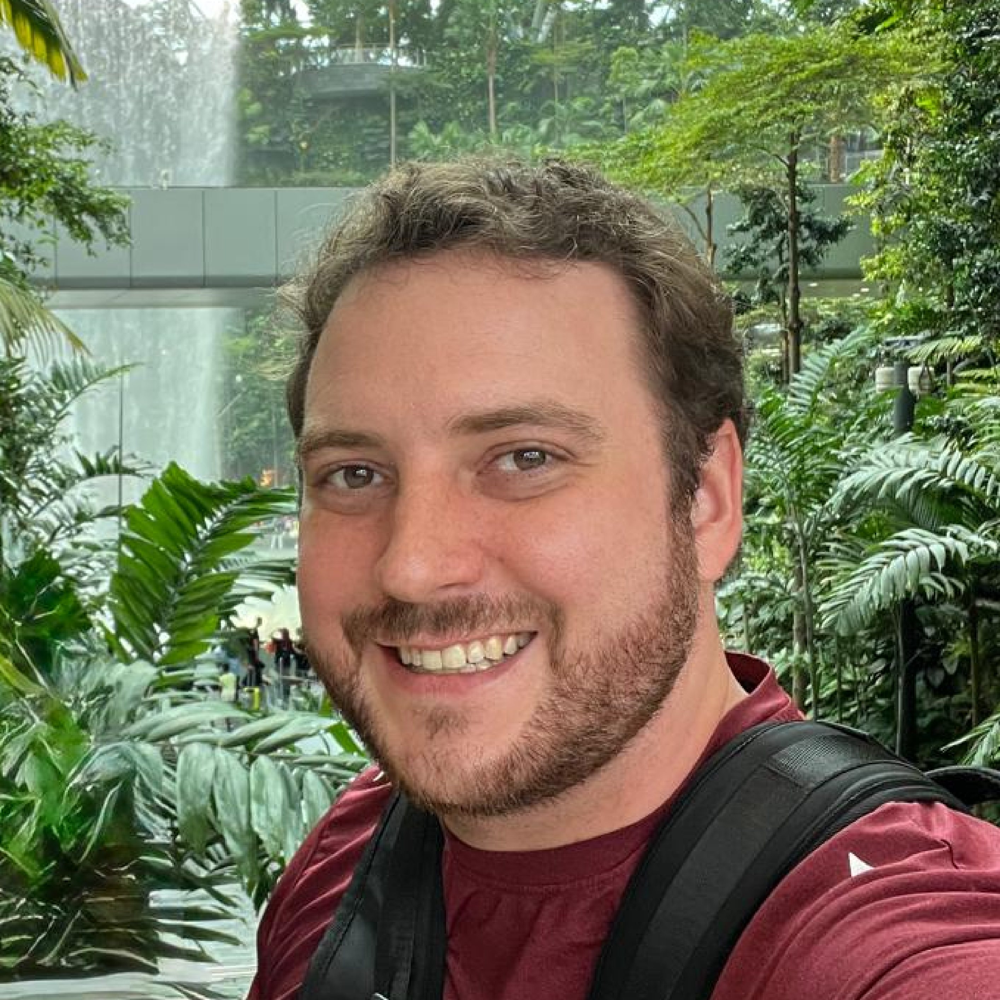
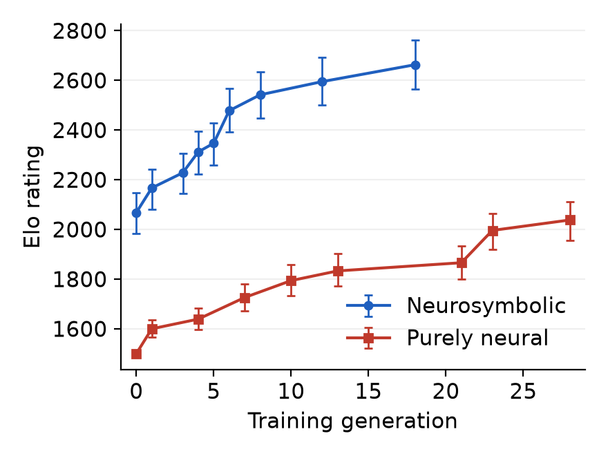
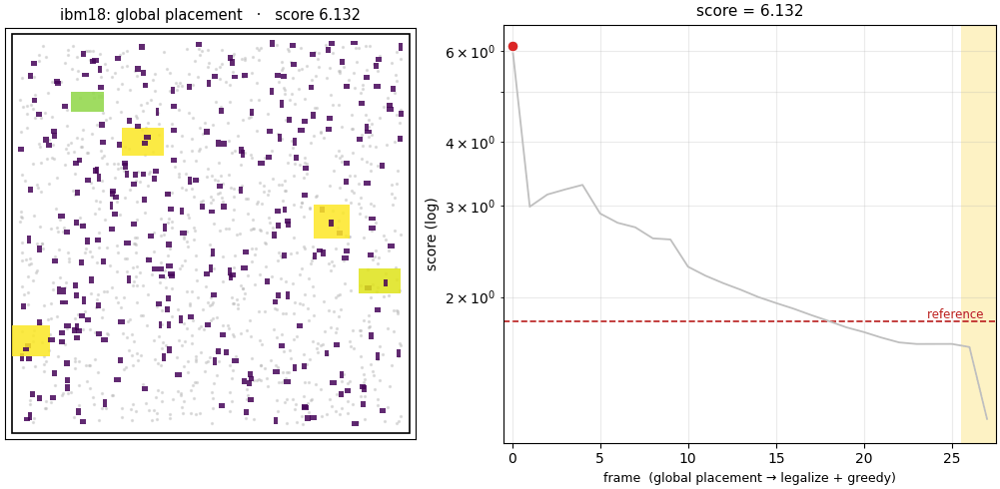
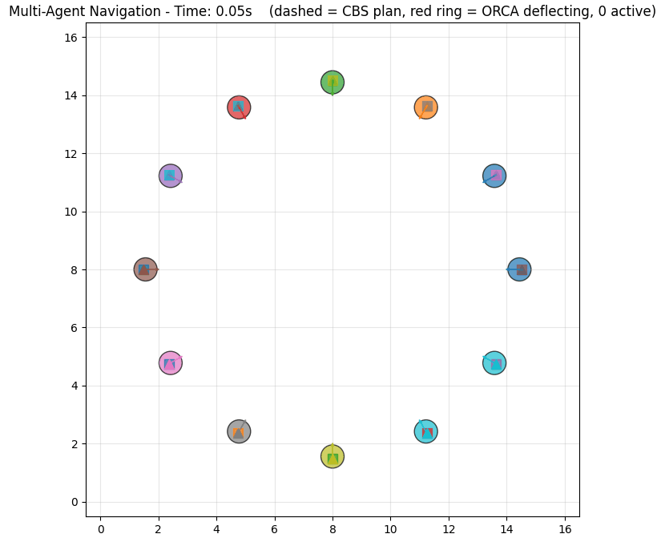
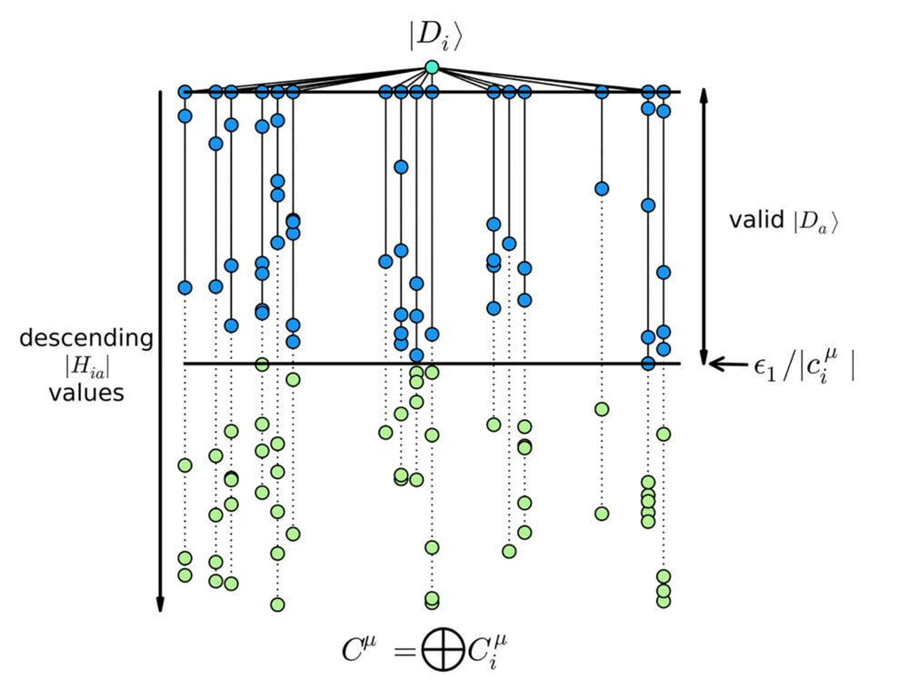
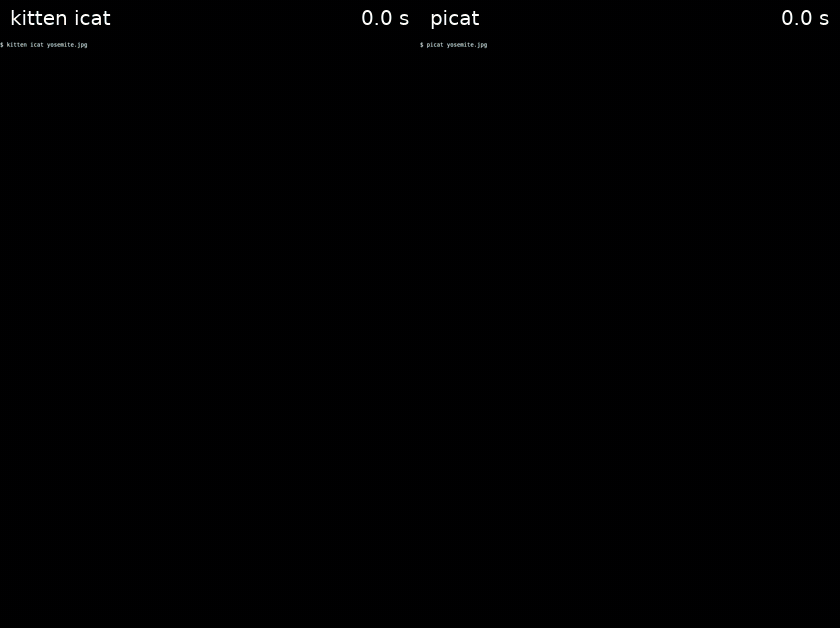

<a href="mailto:adamaholmes@gmail.com">adamaholmes@gmail.com</a> · <a href="https://scholar.google.com/citations?user=K0CAVroAAAAJ">Google Scholar</a> · <a href="https://github.com/aaholmes/">GitHub</a> · <a href="https://www.linkedin.com/in/adamaholmes/">LinkedIn</a>

Hi! I'm a computational physicist and AI researcher (Ph.D. Theoretical Physics, Cornell). I work on hard search problems — where the space of possibilities is far too large to enumerate, and the whole game is deciding what to look at next.

A common thread in my work has always been an approach to such problems: **solve as much of it as you can with efficient exact methods, and fall back on learned or statistical ones for the remainder.** The exact layer reduces what has to be learned, and improves the training signal for what's left.

I started in quantum many-body physics, inventing new deterministic, stochastic, and semistochastic algorithms for high-precision first-principles calculations, using only the fundamental laws of quantum mechanics (2,400+ citations). Since then I've worked on large language model (LLM) efficiency, game playing, theorem proving, and chip design. Along the way I've built production AI systems since 2018 (Transformer-based semantic search, before Google's BERT model made the approach standard), run my algorithms on some of the largest supercomputers in the world at Lawrence Livermore, and built quantitative models for systematic trading at Citadel.

I'm now looking for a role in AI research or systems engineering at an established or early-stage AI lab.

 

---

## Large Language Models

Inference is bottlenecked by memory movement: for every token it generates, the model re-reads its key–value (KV) cache, the stored attention inputs for all earlier tokens. Every way of shrinking that cache is lossy, so the question is how much quality you buy back.

### [Sampling-Based Attention](https://github.com/aaholmes/stochastic-attention)

Attention is a weighted average, so it can be estimated by importance sampling instead of reading the whole cache. With the unbiased estimators I implemented, systematic sampling matches full-model quality in a real model while reading **~3.5% of cached values**, and the fraction shrinks as context grows.

The semistochastic version from my Ph.D. work (largest weights exact, the rest sampled) cuts variance per sample 8–32× but reads no fewer bytes, because the graphics processor (GPU) cache already serves repeat samples of the heavily weighted tokens.

*PyTorch · Monte Carlo · Importance Sampling*

### [Inference Engine + Post-hoc MLA](https://github.com/aaholmes/llms)

I studied converting a trained model's attention to a compressed form, multi-head latent attention (MLA), *after* training, using a from-scratch single-GPU inference engine I wrote for Qwen3, Alibaba's open-weight model family.

To recover the quality lost to compression, I train a small adapter that pulls the model's output distribution back toward the original's. Targeting the **total-variation distance** between the exact and approximate token distributions beats the standard Kullback–Leibler (KL) objective on every fidelity measure. The adapter merges into the weights, so it costs nothing at inference.

*PyTorch · Triton*

### [NanoGPT Single-GPU Harness](https://github.com/aaholmes/nanogpt-1gpu)

I adapted the [modded-nanogpt speedrun](https://github.com/KellerJordan/modded-nanogpt), a community race to train a small GPT model fastest, to a single 16 GB GPU, for screening architecture changes cheaply. It is a research **harness, not a benchmark**: paired same-seed comparisons, per-variant learning-rate matching, and a check that every weight actually trains are all enforced by continuous integration (CI).

*PyTorch · Muon · NorMuon*

---

## Neurosymbolic AI

### [Neurosymbolic Chess Engine](https://github.com/aaholmes/neurosymbolic-mcts)

Self-play engines like AlphaZero learn everything from scratch, including positions a classical solver settles in microseconds. I developed an engine that searches classically first, and rewards any position an exact method can settle, such as a forced mate in N moves, rather than only checkmate. The training signal is denser, and unlike a learned reward model it cannot be gamed. It reaches **~600 Elo above an identically-trained purely neural run, in 18 generations rather than 28.**

*Rust · Monte Carlo Tree Search · PyTorch*

<figure markdown="1">

*Elo by training generation for both runs, with 95% bootstrap intervals, from an 18-model tournament of 6,579 games.*

</figure>

### [Geometry Theorem Prover](https://github.com/aaholmes/geoprover)

I built a prover in which a deterministic engine applies 49 deduction rules until nothing new follows, and a 4M-parameter transformer proposes the step deduction can't find: an auxiliary construction, such as a new point or line. Deduction alone solves 179 of the 231 problems in JGEX, a benchmark used to evaluate DeepMind's AlphaGeometry. The network's proposals raise that to **189/231**, including Morley's theorem and the nine-point circle.

*Rust · PyO3 · PyTorch*

---

## Search & Optimization

### [Electronic Design Automation](https://github.com/aaholmes/macro-placer)

The arrangement of a chip's large memory blocks (macros) largely determines the speed, power, and routability of everything placed after them. I built a macro placer that runs on the GPU. The goal is to optimize a function of wirelength, density (how crowded the blocks are), and congestion (how crowded the wiring is), but only the first two can be written as differentiable scores. So the placer works in two stages: it optimizes wirelength and density by gradient descent, legalizes the result so that no blocks overlap, then runs simulated annealing using the full score, including congestion.

After extensive Bayesian optimization of the hyperparameters, I found that the gradient stage works best when it optimizes wirelength alone at first and only gradually adds the density term, which is why the blocks in the animation collapse together and then slowly spread out. I ran it on a public challenge's 17 benchmarks, with one hour of compute each, after the challenge had closed. It scored **33% better than RePlAce**, a standard placement algorithm, with zero overlaps, which would have placed 4th. [Full write-up](/projects/macro-placement/).

*PyTorch · GPU · Simulated Annealing*

<figure markdown="1">

*One complete run on benchmark ibm18: the layout as it spreads, legalizes and improves (left), and the score per frame, with the reference placement marked (right).*

</figure>

### [MMR-Elites](https://github.com/aaholmes/mmr-elites)

Often you want a diverse set of good solutions rather than the single best, but selecting on quality alone gives redundancy, because the best candidates cluster together. I developed MMR-Elites, which treats keeping such a set as **submodular maximization**, where each added item is worth less the more you already have, which makes greedy selection near-optimal. Borrowing Maximum Marginal Relevance (MMR) from information retrieval, it uses fixed O(K) memory and O(K log K) selection, and gives 12× better uniformity in 20-dimensional behavior spaces than MAP-Elites, the standard method, which keeps the best solution in each cell of a grid. Choosing a varied, high-quality subset of LLM samples is an analogous problem.

*Rust · PyO3 · Python*

### [Multi-Agent Path Planning](https://github.com/aaholmes/multiagent-pathplanning)

I built a two-layer system for optimal multi-robot navigation. A global planner (Conflict-Based Search, CBS) computes provably optimal, collision-free routes for every robot before anything moves; a local controller (Optimal Reciprocal Collision Avoidance, ORCA) adjusts each robot's velocity moment to moment for whatever the plan couldn't anticipate.

*Rust · PyO3 · CBS · ORCA*

<figure markdown="1">

*The test case from the ORCA paper, with local avoidance only: twelve agents on a circle each head for the opposite point. A red ring marks an agent being deflected.*

</figure>

---

## Quantum Many-Body Algorithms

I like to think of quantum many-body physics as a graph search problem, but an unusually challenging one because it is a graph too large to even store! The nodes are electron configurations, and a molecule's state is a weighted combination of them. Earlier methods generated enormous numbers of candidate configurations and tested each one. During my Ph.D. I developed a physics-informed heuristic that jumps straight to the ones that matter, called Heat-Bath Configuration Interaction, or HCI ([Holmes et al., *JCTC* 2016](https://arxiv.org/pdf/1606.07453)). "Configuration interaction" is the field's term for representing a state this way. The heuristic is the deterministic analogue of the heat-bath sampling algorithm I invented previously, which is why I named the method after it.

With my colleagues I then removed the memory bottleneck in perturbation theory, the step that accounts for configurations left out, by pairing a deterministic approximation built on that heuristic with stochastic sampling that corrects it ([Sharma, Holmes et al., *JCTC* 2017](https://arxiv.org/pdf/1610.06660)). Together these became Semistochastic HCI (SHCI), now a benchmark algorithm in electronic structure theory, implemented in major quantum chemistry packages. With it we computed near-exact energy curves for fourteen states of the carbon dimer (~**10²¹** configurations), now a reference for quantum computing and neural-network methods. We also computed a near-exact binding curve for the chromium dimer (~**10⁴²** configurations), where most methods fail badly ([Li, Yao, Holmes et al., *Phys. Rev. Res.* 2020](https://journals.aps.org/prresearch/pdf/10.1103/PhysRevResearch.2.012015)).

<figure markdown="1">

*Matrix elements are precomputed and sorted by magnitude, so for each candidate the algorithm walks the list only until it drops below a threshold set by the current coefficient. Blue is generated; green is never touched. Figure from [Smith, Mussard, Holmes & Sharma, *JCTC* 2017](https://doi.org/10.1021/acs.jctc.7b00900) (open access).*

</figure>

### Selected papers

- **Semistochastic projector Monte Carlo method.** F. R. Petruzielo, **A. A. Holmes**, H. J. Changlani, M. P. Nightingale, C. J. Umrigar. *Phys. Rev. Lett.* 2012. [doi](https://doi.org/10.1103/PhysRevLett.109.230201) Introduces semistochastic methods, making a stochastic method 1000× more efficient by solving deterministically a small subproblem where sampling would otherwise fluctuate most.
- **Efficient heat-bath sampling in Fock space.** **A. A. Holmes**, H. J. Changlani, C. J. Umrigar. *J. Chem. Theory Comput.* 2016. [doi](https://doi.org/10.1021/acs.jctc.5b01170) Factors the probability of two electrons repelling each other into new orbitals as a product of separate probabilities for choosing each electron and each target orbital, which can be approximated and precomputed, sampling 50× more efficiently than the uniform sampling used before.
- **Heat-bath configuration interaction.** **A. A. Holmes**, N. M. Tubman, C. J. Umrigar. *J. Chem. Theory Comput.* 2016. [doi](https://doi.org/10.1021/acs.jctc.6b00407) Introduces a heuristic and a precomputation scheme that find the most important configurations directly, rather than first generating and checking long lists of candidates.
- **Semistochastic heat-bath configuration interaction.** S. Sharma, **A. A. Holmes**, G. Jeanmairet, A. Alavi, C. J. Umrigar. *J. Chem. Theory Comput.* 2017. [doi](https://doi.org/10.1021/acs.jctc.6b01028) Removes the memory bottleneck in the perturbative correction by splitting it into a deterministic part and a sampled part.
- **Excited states using semistochastic heat-bath configuration interaction.** **A. A. Holmes**, C. J. Umrigar, S. Sharma. *J. Chem. Phys.* 2017. [doi](https://doi.org/10.1063/1.4998614) Introduces a more accurate way to extrapolate to the exact answer, and a benchmark of high-precision excited-state energy curves for the carbon dimer.

 

---

## Tools

Small tools I built for my own workflow; both are open source.

### [butwhy.nvim](https://github.com/aaholmes/butwhy.nvim)

One of my favorite uses of LLMs is helping me understand things. I built a plugin for the Neovim text editor that explains any text I highlight, whether prose, code, or a LaTeX equation, in a pop-up beneath it, pitched to a short description of my background. If that's still unclear, asking "but why?" re-explains it one level simpler, as many times as needed. It works with hosted or local models.

<figure markdown="1">

</figure>

### [picat](https://github.com/aaholmes/picat)

I often do remote development work, sometimes over slow coffee-shop Wi-Fi, and like to view images on the remote machine without copying them locally first. So I built picat (progressive icat, after the image viewer built into the kitty terminal), which shows a blurry preview immediately and then sharpens it, sending the most detailed parts first. Over a 10 Mbit/s link, a 3024×4032 photo, scaled to fit a 1000×1400-pixel window, is sharp in 0.8 s, where kitty's own viewer shows nothing until 4.1 s. The command prompt becomes available again as soon as the first preview appears, and the rest of the image loads in the background without interfering with typing responsiveness.

<figure markdown="1">

</figure>

 

---

#### Contact

I'm always happy to chat about research, projects, or opportunities. Reach me via [email](mailto:adamaholmes@gmail.com) or on [LinkedIn](https://www.linkedin.com/in/adamaholmes/).